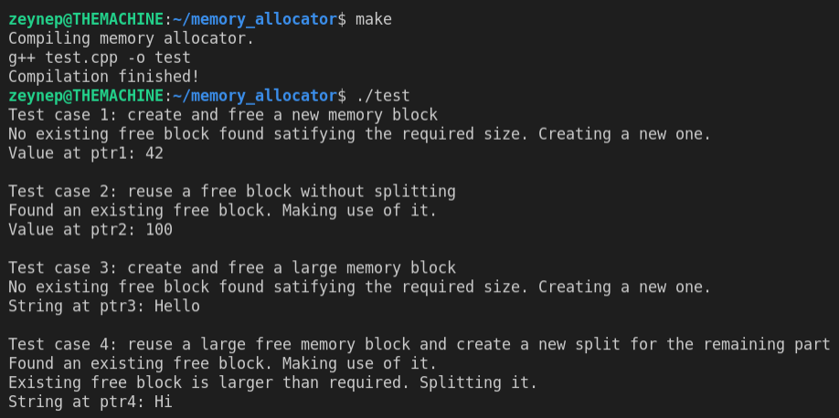

# Memory allocation library

**Keywords**: *C++, POSIX, mutex, sbrk*

This is a C++ project consisting of a memory management library calls (*_malloc* and *_free*) and a tester.

## Design

The project basically provides a library for memory allocation and deallocation functionalities. It makes use of *sbrk* system call ([link](https://man7.org/linux/man-pages/man2/brk.2.html)). The main design idea behind this project is to avoid *sbrk* system calls as they are very expensive (it requires context switch to the kernel mode and back to the user mode). To achieve that, deallocated (freed) memory allocations are reused for new allocation requests. 

In this project, each memory allocation operation is represented as a *Block*. Each *Block* has a size and a pointer to the next block. The reason to have the next block pointer is to maintain a linked list of free blocks. 

**Upon each new allocation request**, the library first sees if there is a deallocated *Block* available that can be reused. 
- If there is, the library further checks if the given block has more space than the required size. If so, it reuses the required size portion of the available memory and adds the remaining part back to the free blocks chain so that it can also be reused on new requests.
- If not, it makes a system call to allocate a new memory region with given size.

**Upon each new deallocation request**, the library just adds the given block to the free blocks chain to enable reuse in allocation requests.

To allow multiple threads making use of this library, each *_malloc* and *_free* call is protected by a global mutex.
  

## How to run

This project is tested on an Ubuntu 18 machine.

1- On project root, execute: **make**. This will create an executable **test**.

2- On project root, execute: **./test**.

3- Optional: You can update the test calls in *main()* method of *test.cpp* file. 

## Example test run

